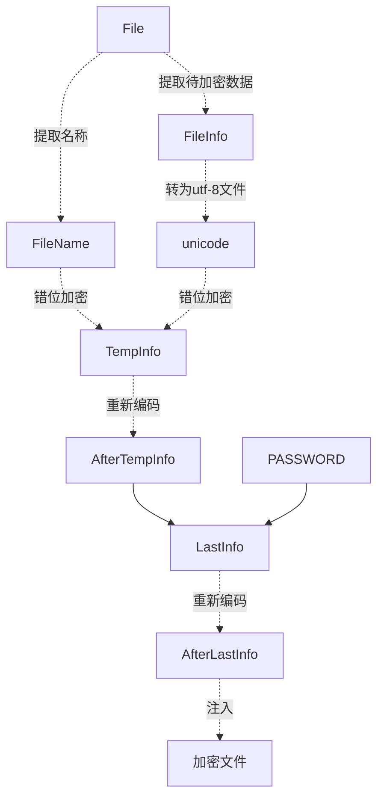

# encayption_core

# 加密🔐核心

> 我喜欢加密！我有数据，我给你看你才能看，我不给你看，你就不要偷走我的数据！

* 我可以不用加密🔐手段，但是不能没有！

## 你是否想要找一个数据基地，你发现GitHub可以当一个数据基地，但是数据却是并非太安全，那就给他手动按一个锁🔒！

# 文件加密工具🔐

## 使用规划

## 加密方式

该工具主要针对字符文件加密

* 源代码元件
* 文本文件

### 支持加密文件类型

* txt
* markdown
* cpp[c,h,cpp]
* java
* html
* js
* py
* dart
* ...

## 加密原理

